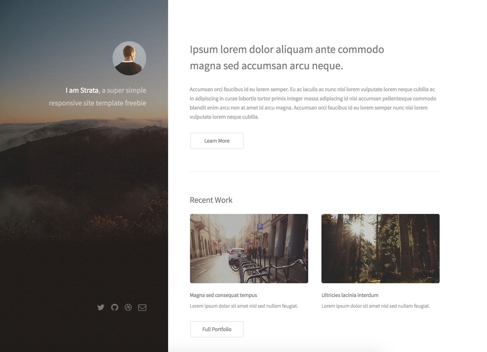

# Övningar - Repetition 2

## CSS Selectors

### Övning 1
Skapa en lista med 10 länkar. Använd dig av CSS för att:

a) Ge alla länkarna font-size: 18px.

b) Ge varannan länk en annan färg.

c) Ge vart tredje länk en annan färg om man håller muspekare över länken.

d) Göm den sista länken

### Övning 2
Utgå från [följande kod](https://jsfiddle.net/andreas_lofgren/13c2kLye/).

a) Använd :not-selectorn för att göra alla knapparnas bakgrundsfärg gråa utom den tredje länken.

b) Använd :not-selectorn för att göra alla knapparnas bakgrundsfärg gråa utom den sista.

## Responsiva kort
Skapa följande responsiva layout (innehållande 6 rutor) i 3 olika storlekar:

Stort fönster (3 x 2)

Mellan fönster (2 x 3)

Litet fönster (1 x 6)

Prova att implementera layouten tre olika gånger med hjälp av flexbox, bootstrap och grid.

Fundera över vilken teknik du tyckte fungerade bäst respektive sämst.

## Transform & Transition

### Övning 1

Lägg 3 likadana bilder på en sida. Använd transform för att:

a) Spegelvända den första bilden

b) Vänd upp och ner på den andra bilden

c) Göra den tredje bilden dubbelt så stor.

### Övning 2

Skapa en cirkel som har en gradient-bakgrund och gör så att den snurrar när man håller muspekaren över den.

### Övning 3
Skapa ett rutnät som ser ut som bilden nedan:

Använd sedan transform för att få till ett liknande mönster:

## Designer

Implementera designerna nedan. Använda antingen Flexbox, Bootstrap eller Grid.

### Övning 1

### Övning 2

### Övning 3

### Övning 4

(Designer från bland annat getbootstrap.com & HTML5UP)
