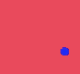
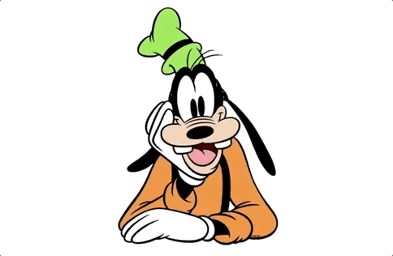
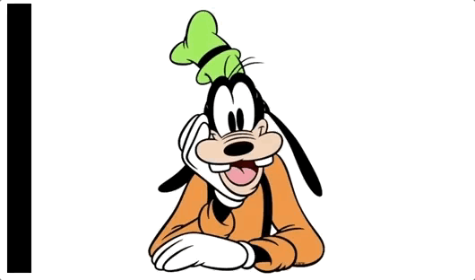

# Övningar - Animationer

## Övning 1
Skapa en animation som gör att bakgrundsfärgen på en ruta går från gul till grön över 2 sekunder.

a) Gör så att animationen sker ett oändligt antal gånger

b) Gör så att animationen växlar tillbaka till gul efter att den blivit grön.

c) Lägg in att animationen ska ha 3 sekunders delay.

## Övning 2
Lägg in en bild på en HTML-sida och skapa en animation där bilden går igenom följande tillstånd:

* Bilden har sin ursprungsstorlek.
* Bilden är dubbelt så stor som normalt.
* Bilden är hälften så stor som normalt.
* Bilden återgår till sin ursprungsstorlek.

## Övning 3
Skapa en animation som på bilden nedan:

## Övning 5
Skapa en animation som får bilden på myntet (coin.png) att snurra runt sin egen axel ett oändligt antal gånger.

## Övning 6
a) Skapa ett simpelt bildgalleri och använd dig av Animate.css för att få bilderna att tona in (fade) när man laddar sidan.

b) Ändra så att bilderna istället roterar in från höger.

## Övning 7
Återskapa följande animation:

Bilden hittar du [här.](https://i.imgur.com/rCc04KN.png)

## Övning 8
Modifiera lösningen i förra uppgiften och försök skapa följande animation:

## Övning 9
Provat att skapa följande animation:

## Övning 10

Prova att skapa följande animation:

