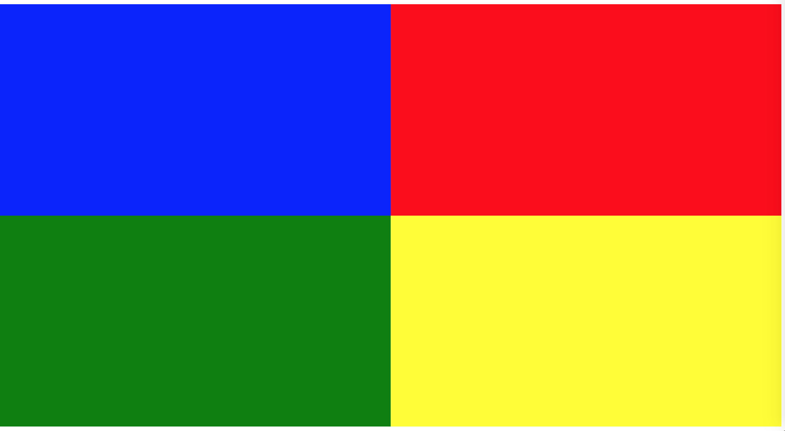
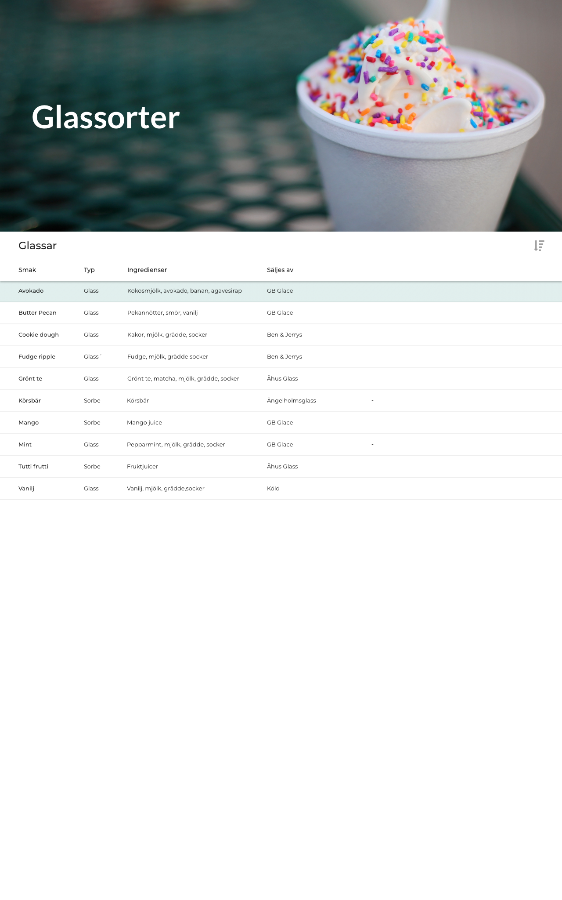
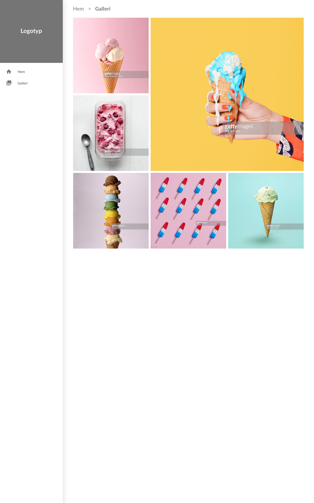

# CSS

## Övningar

###  a) Skapa fyra boxar som täcker skärmen med en färg var.

###  b) I boxarna - skriv ut i mitten av boxarna vilken färg de är

Skriv en text i mitten av varje box som berättar vilken färg boxen tillhör.

###  c) Styla en sida som visar ett CV, som bilden visar

###  d) Bygg en tabell som listar olika typer av glass-smaker, som ser ut som följande

###  e) Bygg ett galleri som bilden visar

