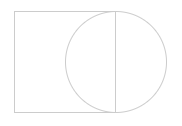
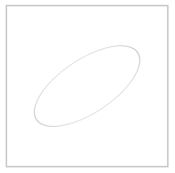
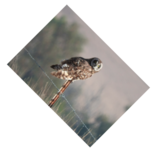
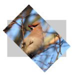
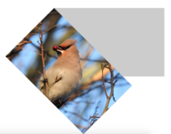
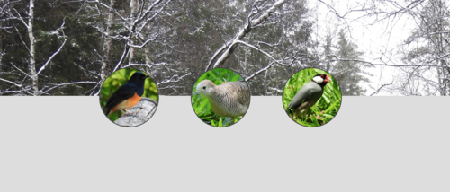

# Övningsuppgifter - CSS Transform

## Övning 1
a) Använd `transform`-propertyn för att göra rektangeln dubbelt så stor.

b) Använd `transform`-propertyn för att göra rektangelns bredd dubbelt så stor.

c) Använd `transform`-propertyn för att göra rektangelns bredd 3 gånger så stor och höjden hälften så stor.

## Övning 2
a) Använd `transform`-propertyn för att flytta cirkeln innanför rektangeln.

b) Använd `transform`-propertyn för att göra cirkeln dubbelt så stor och flytta rektangeln innanför cirkeln.

c) Använd `transform`-propertyn för att överlappa cirkeln och rektangel på följande vis:

d) Använd `transform`-propertyn för att överlappa cirkeln och rektangel på följande vis:

e) Använd `transform`-propertyn för att visa formerna på följande vis:

## Övning 3

a) Använd `transform`-propertyn för att vända bilden på ugglan upp och ner.

b) Använd `transform`-propertyn för att spegelvända bilden.

c) Använd `transform`-propertyn för att vända bilden så här:

d) Hur fungerar transform-origin? Vad händer om du t.ex. använder `transform-origin: 0` på din lösning på uppgift c)?

## Övning 4
Skapa följande mönster med hjälp av 3 likadana cirklar och `transform`-propertyn:

Utför uppgiften med hjälp av `transform` utan att ändra på `height` eller `width`-attributen.

## Övning 5

a) Rotera bilden med hjälp av `transform` enligt följande bild:

b) Rotera bilden med hjälp av `transform` enligt följande bild:

c) Rotera bilden med hjälp av `transform` enligt följande bild:

## Övning 6
Använd dig av bland annat `transform` för att skapa följande resultat:

