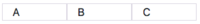
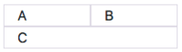
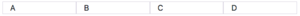
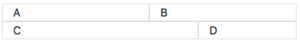
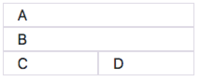
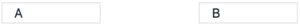
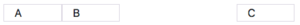
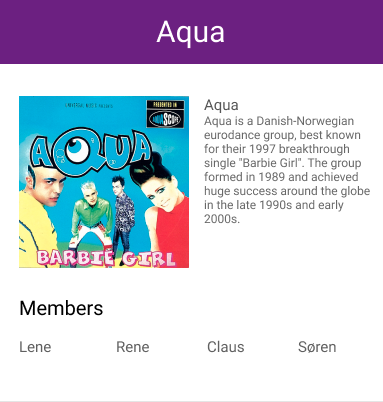
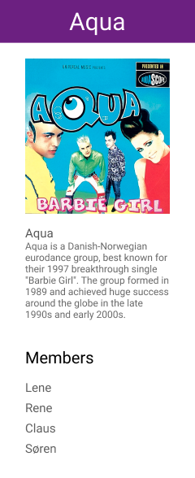
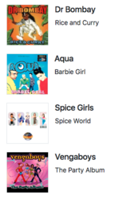

# Övningar - Bootstrap

## Övning 1
Använd bootstraps `col` och `row`-klasser för att bygga följande strukturer:

a)


b)


c)


d)


e)


## Övning 2

a) Vad kommer att hända med den andra kolumnen i följande kod? Varför?
```html
<div class="container">
  <div class="row">
    <div class="col-6">
      <!-- column content -->
    </div>
    <div class="col-7">
      <!-- column content -->
    </div>
  </div>
</div>
```
b) Vad kommer att hända med de två sista kolumnerna i följande kod? Varför?
```html
<div class="container">
  <div class="row">
    <div class="col-6">
      <!-- column content -->
    </div>
    <div class="col-7">
      <!-- column content -->
    </div>
    <div class="col-5">
      <!-- column content -->
    </div>
  </div>
</div>
```

c) Vad händer med de två sista kolumnerna i följande kod? Varför?
```html
<div class="container">
  <div class="row">
    <div class="col-4">
      <!-- column content -->
    </div>
    <div class="col">
      <!-- column content -->
    </div>
    <div class="col">
      <!-- column content -->
    </div>
  </div>
</div>
```

## Övning 3
Skapa följande med hjälp av bootstrap:

a) En rad med två kolumner där kolumnerna endast visas på samma rad om bredden är större än 540 pixlar.

b) En rad med två kolumner där kolumnerna endast visas på samma rad om bredden är större än 1140 pixlar.

c) En rad med fyra lika stora kolumner där alla kolumnerna visas på egna rader på små skärmar om bredden är mindre än 540 pixlar.

d) En rad med fyra lika stora kolumner där de två sista kolumnerna visas på egna rader om bredden är mindre än 540 pixlar.

e) En rad med tre lika stora kolumner där den sista kolumnen ska fylla ut en ny egen rad om bredden är mindre än 540 pixlar. Jämför bilderna nedan:





f) En rad med tre kolumner där den mittersta kolumnen ändrar sig beroende på längden på innehållet.

*Tips: Använd bootstrap breakpoints*

## Övning 4
a) Implementera en layout med 4 kolumner **inom samma `.row`-element** där de två sista kolumnerna visas på en egen rad. Använd dig av bootstraps grid-klasser.

b) Implementera samma som i uppgiften ovan med hjälp av `.w-100`

## Övning 5
Använd dig av breakpoints för att implementera en layout som följer följande mönster
beroende på containerns storlek:

Stor:



Mellan:



Liten:



## Övning 6
a) Visa filen `blomma.png` och `uggla.png` enligt layouten nedan. Använd bootstrap för att göra bilderna responsiva så att de ändrar storlek beroende på fönstret.


b) Implementera följande layout på liknande sätt med hjälp av bootstraps klasser.


c) Implementera a) så att `uggla.png` hamnar på en egen rad om fönstret är litet.

d) Implementera följande layout på liknande sätt med hjälp av bootstraps klasser.


Bilderna finns i mappen _resources_.

## Övning 7
Implementera följande layouter med hjälp av bootstrap:

a)



b)


c)



## Övning 8
Skapa en ny HTML-sida och använd dig av bootstrap för implementera en responsiv layout enligt följande mocks:

Stort fönster:



Litet fönster:



Bilden finns i mappen _resources_.

## Övning 9
Använd `.media`-klassen i bootstrap för att skapa en lista med album som i följande mocks:



Bilden finns i mappen _resources_.

## Övning 10
Lista följande data i en bootstrap-tabell

| Namn          | Ålder           | Stad | Tröjstorlek |
| ------------- |------------- | ---- | ----------- |
| Lisa Svensson    | 45 | Ängelholm | M |
| Gunnar Gunnarsson    | 19 | Borlänge | M |
| Mia Larsson | 33 | Boden | XL |
| Kim Ek | 87 | Åmål | S |

## Övning 11

a) Hur kan du använda dig av bootstraps `display`-klasser för att kontrollera när ett element ska visas? Implementera ett exempel där en bild visas på små skärmar men göms på stora skärmar?

b) Förklara skillnaden mellan `d-none`-klassen och `visible`-klassen i bootstrap. Implementera ett exempel som visar på skillnaderna.

## Övning 12
Skapa en HTML-sida för att registrera användaruppgifter. Du får själv utforma hur sidan ska se ut men den ska uppfylla följande krav:

* Användaren ska kunna skriva i sitt för- och efternamn i ett input-fält.
* Användaren ska kunna fylla i sin ålder.
* Användaren ska kunna fylla i sitt telefonnummer och email.
* Användaren ska kunna välja en sysselsättning ur en lista mellan följande alternativ:
  * Anställd
  * Egen företagare
  * Arbetssökande
  * Sjukskriven
  * Annat
* Användaren ska kunna välja att acceptera sidans villkor genom att klicka i en checkbox.
* Det ska finnas en knapp med titeln "Registrera".

## Övning 13
a) Skapa en header med hjälp av bootstrap-komponenter som innehåller följande:
* En bild på en logotyp (Välj valfri logo från ett företag)
* En dropdown-meny med länkar till undersidor. (Länkarna behöver inte leda till något)
* En sökruta

b) Skapa en sidomeny med hjälp av `nav`-klassen och använd samma länkar som i a). Menyn ska ligga till vänsterkanten på html-sidan.

c) Göm sidomenyn i b) om sidans bredd är liten.

## Övning 14
Använd dig av bootstrap för att skapa en sida där du presenterar dig själv. Sidan kan t.ex. presenteras som ett CV genom att innehålla en kort beskrivning av dig själv, dina yrkeserfarenheter och utbildningar, samt innehålla en bild på dig själv.

Sidan bör också vara responsiv och se bra ut på både stora och små skärmar.
