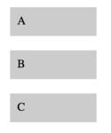
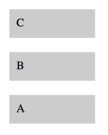
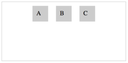
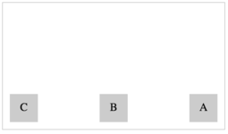
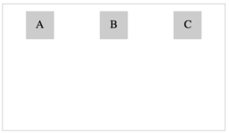

# Övningar - Flexbox

## Övning 1
Använd dig av flexbox för att visa boxarna på följande sätt:

a)

b)

c)

## Övning 2

Använd flexbox för att bygga följande strukturer enligt bilderna nedan.

a)

b)

c)

d)

## Övning 3

Använd flexbox för att ändra egenskaperna hos boxarna så att:

* Bredden på varje box är max 200px
* Om boxarna inte får plats ska boxen i mitten krympa dubbelt så fort som de andra två.

_Tips: Använd **flex-basis**_

## Övning 4

Använd flexbox för att visa boxarna på följande sätt:

a)

b)

c)

d)

## Övning 5

Använd flexbox för att visa boxarna på samma rad. Om boxarna inte får plats på samma rad ska resterande boxar fortsätta på nästa rad som på bilderna nedan:

a)

b)

c)

d)

## Övning 6
Använd flexbox för att visa boxarna på följande sätt:

a)

b)

## Övning 7
Du har fått i uppdrag att skapa en layout för en nyhetssida. Uppdragsgivaren vill se en layout för startsidan enligt följande krav:

* Logon ska synas (logo.png) längst upp på sidan.
* Rubriken på 5 olika artiklar ska synas.
* Till varje rubrik ska det synas en bild ovanför.
* Två artiklar (bild och rubrik) ska kunna visas bredvid varandra om fönsterstorleken är tillräckligt stor.
* Bilderna får aldrig vara bredare än 80% av fönsterstorleken.
* Rubrikernas storlek ska anpassas till storleken på skärmen.

a) Använd valfritt verktyg för att skapa en designskiss för layouten. Gör en skiss för desktop och en för mobil. Du kan designa sidan hur du vill så länge kraven ovan är uppfyllda.

b) Utgå från `news.html` och använd flexbox för att implementera din layout.

## Fler övningar

* [Flexbox Froggy](https://flexboxfroggy.com/)
* [Flexbox Defense](http://www.flexboxdefense.com/)
