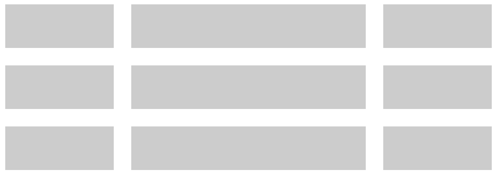
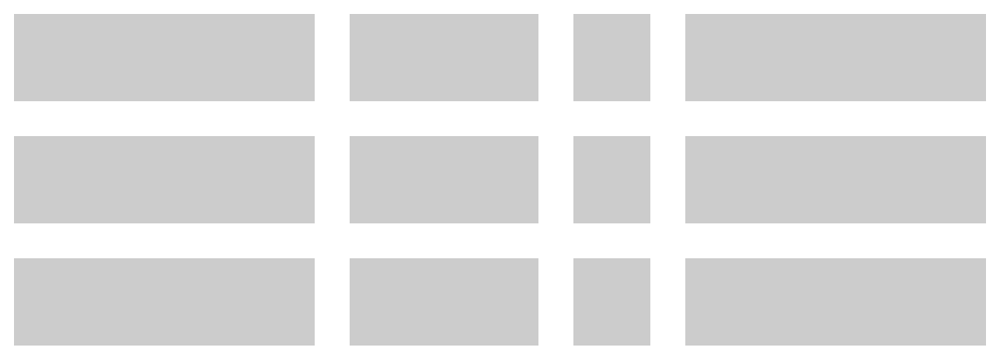
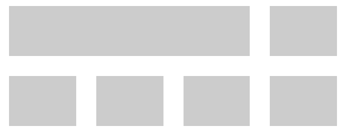
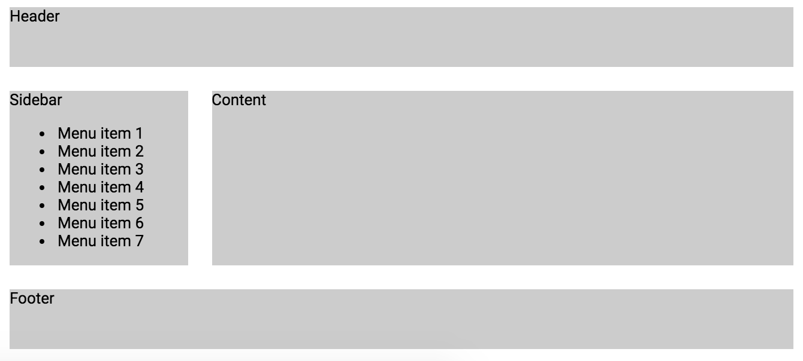
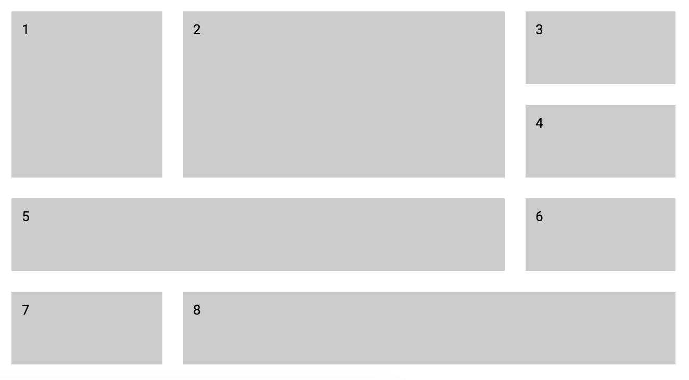
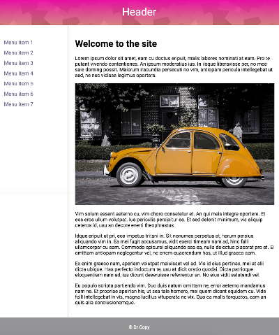
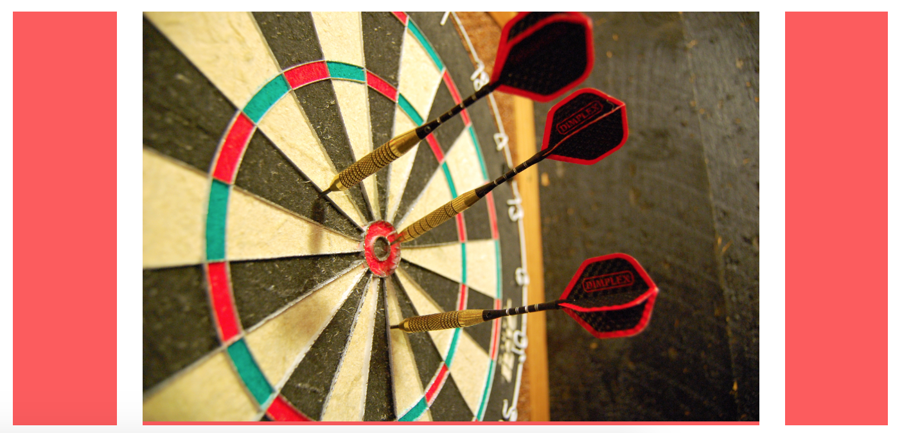
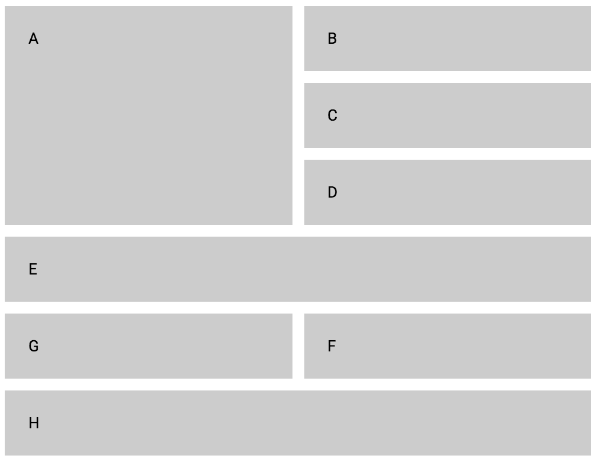
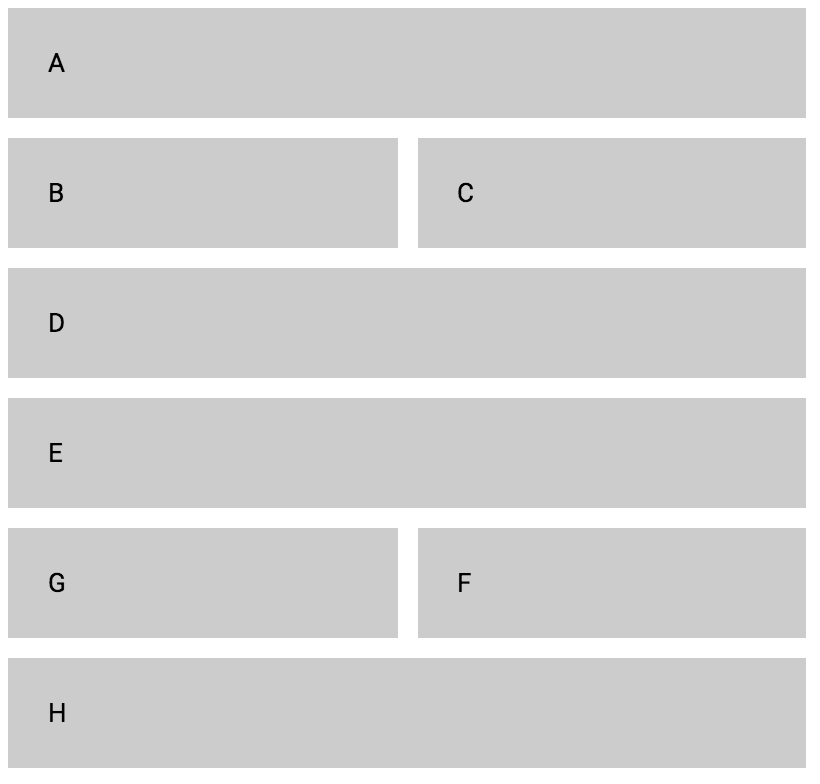

## Övning 1
Skapa följande layoutmönster med hjälp av grid:

a) 

b) 

c) 

## Övning 2
Skapa följande layout:

a)

b)

c)

## Övning 3
Gör följande layout-mönster med hjälp av grid:

## Övning 4
Prova att skapa följande mönster med hjälp av grid:

## Övning 5
Modifiera din lösning från övning 3 så att det liknar bilden nedan.

Du kan använda bilderna `car.png`och `pattern.png` i mappen `resources`.

## Övning 6

Skapa en layout med hjälp av grid enligt bilden nedan. Bilden i mitten ska alltid vara 500px bred, men ytorna runtomkring ska växa och krympa responsivt.

## Övning 7

Använd dig av grid-template-areas för att bygga följande mönster:

a)

Använd dig av media queries för att ändra till följande layout på små skärmar:

b)

## Övning 8
Gör ett bildgalleri som ser ut så här:

Du kan använda bilderna i mappen `resources/gallery1`.

## Övning 9
Implementera följande galleri med hjälp av grid:

(Du behöver inte använda samma bilder)

## Fler övningar
http://cssgridgarden.com/
