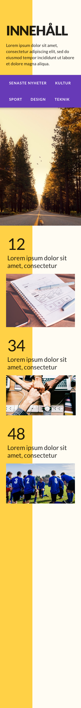

# CSS

## Övningar
Alla dessa övningar är mobilanpassade versioner av tidigare övningar.
Återanvänd era tidigare lösningar och gör så att de blir responsiva enligt bilderna nedan.

###  a) 

###  b) 

###  c) 

