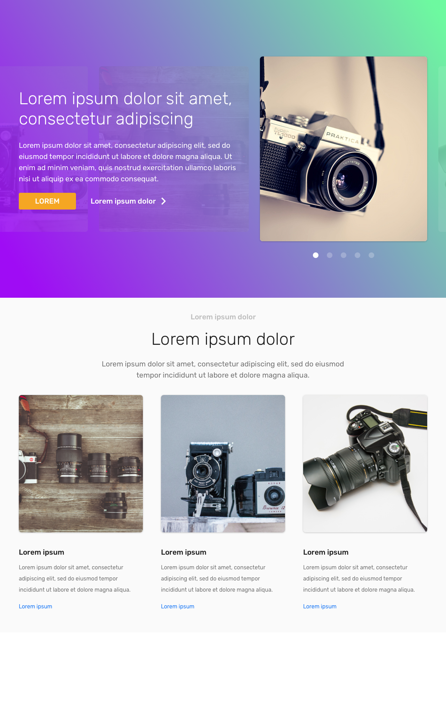
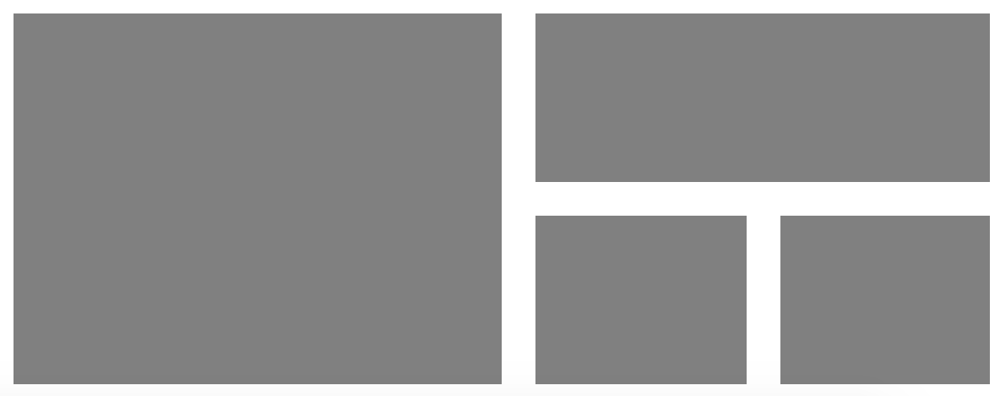
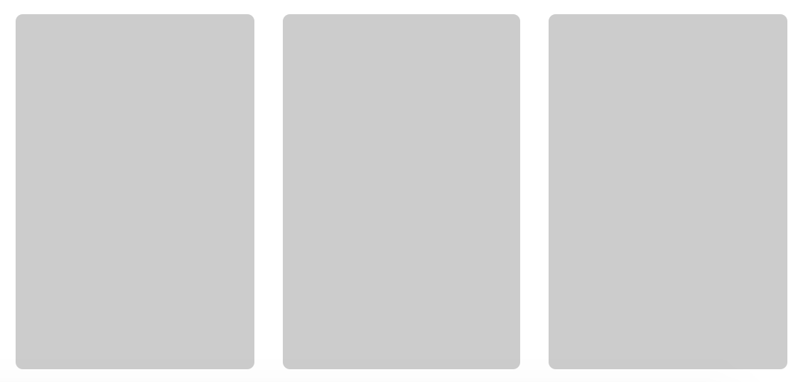
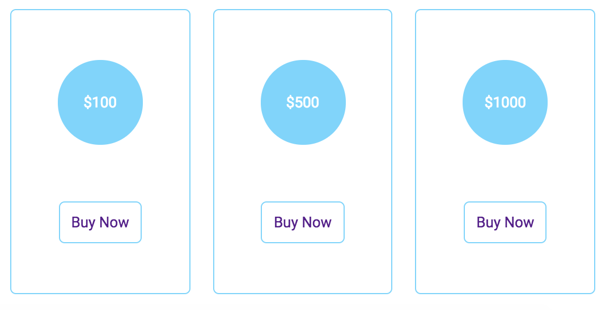

# Övningar - Repetition

## CSS Selectors

## Övning 1

Utgå från koden [här](https://jsfiddle.net/andreas_lofgren/orx3ck4e/) för att göra följande ändringar:

(OBS: Ändra inte på den befintliga HTML eller CSS-koden. Använd heller inte !important)

a) Lägg in att varannat li-element i den första listan har grå textfärg.

b) Sätt list-style: none på den första listan.

c) Göm li-elementet som innehåller texten "Beer".

d) Gör så att alla element som kommer efter h3-taggen har margin-left: 30px.

## Övning 2

Utgå från koden [här](https://jsfiddle.net/andreas_lofgren/bcm4kxL8/) för att göra följande ändringar:

(OBS: Ändra inte på den befintliga HTML eller CSS-koden. Använd heller inte !important)

a) Skapa en CSS-regel som gör boxarna A-H blå bakgrundsfärg.

b) Skapa en CSS-regel som gör boxarna A, C, E, G röd bakgrundsfärg.

c) Skapa en CSS-regel som gör att boxarna I, J, K får grön bakgrundsfärg.

d) Skapa en CSS-regel som gör att boxen L får bakgrundsfärgen Lila.

## Media Queries

### Övning 1
Skapa en media query som vid små fönsterstorlekar byter ut en lista med länkar mot en knapp.

### Övning 2
Skapa en sidebar med ett antal länkar:

* Min Profil
* Inställningar
* Meddelanden
* Logga ut

Gör så att länkarna byts ut mot passande ikoner istället om fönsterstorleken är liten. Ett tips är att använda dig av [Font Awesome](https://fontawesome.com/how-to-use/on-the-web/setup/getting-started?using=web-fonts-with-css). För att använda det behöver du göra följande:

1. Ladda in Font Awesomes CSS genom att lägga till följande i din head:
```
<link rel="stylesheet" href="https://use.fontawesome.com/releases/v5.3.1/css/all.css" integrity="sha384-mzrmE5qonljUremFsqc01SB46JvROS7bZs3IO2EmfFsd15uHvIt+Y8vEf7N7fWAU" crossorigin="anonymous">
```

2. Lägg in en ikon på din sida genom att skriva:
```
<i class="fas fa-user"></i>
```

Sök efter fler ikoner [här](https://fontawesome.com/icons?d=gallery&q=user).


## Bootstrap

### Övning 1
Implementera följande design med hjälp av Bootstrap:



Gör designen så responsiv som möjligt.

Bilderna finna i mappen resources.

## Flexbox

### Övning 1

Skapa ett responsivt rutnät med hjälp av flexbox. Bilden illustrerar hur rutorna ska se förhålla sig till varandra enligt följande krav:

* Den vänstra rutan ska växa dubbelt så snabbt på breddden som de två högra.

* En ruta får aldrig vara mindre än 50px i bredd.


### Övning 2

Skapa ett responsivt rutnät med hjälp av flexbox. Bilden illustrerar hur rutorna ska se förhålla sig till varandra.

* Den vänstra rutan ska växa dubbelt så snabbt på breddden som de två högra.

* En ruta får aldrig vara mindre än 50px i bredd.


### Övning 3

Skapa ett responsivt rutnät med hjälp av flexbox. Bilden illustrerar hur rutorna ska se förhålla sig till varandra.

* Den vänstra rutan ska växa lika så snabbt på breddden som den översta av de tre högra rutorna.

* De två understa av de högra rutorna ska alltid vara lika breda.

* En ruta får aldrig vara mindre än 50px i bredd.



### Övning 4

Skapa en layout som beter sig enligt följande:



Stor skärm


Mellan skärm


Liten skärm

### Övning 5

Modifiera lösningen i Övning 4 och lägg in en prismeny enligt följande skiss:



### Övning 6

Prova att implementera Bootstrap-layouten ovan med hjälp av flexbox istället för Boostrap Grid Layout. (Du kan fortfarande använda bootstrap-komponenterna om du vill)
